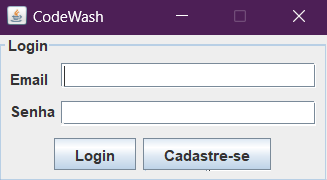

 

  <h3 align="center">Code Wash</h3>

  

    O CodeWash é um sistema de lava-jatos que permite aos usuários se cadastrar como clientes ou administradores de lava-jatos. Com essa aplicação, os clientes podem agendar horários e comprar produtos. Já os administradores têm a possibilidade de gerenciar os horários que cada clientes de seus próprios lava-jatos marcaram e adicionar, remover e editar produtos.
     
     
  

   

## Sumario

* [Sobre o Projeto](#sobre-o-projeto)
* [Iniciando](#iniciando)
  * [Prerequisitos](#prerequisitos)
  * [Instalação e Execução](#instalacao-e-execucao)
* [Autores](#autores)

## Sobre o Projeto

O projeto está organizado em diferentes pacotes e classes, que são responsáveis por diferentes funcionalidades. A estrutura do projeto é a seguinte:

- ### Controler
- CodeWash.controller: Esse pacote contém as classes responsáveis pelo controle das telas iniciais do programa, como cadastro, login e gerenciamento da interface gráfica.
- CodeWash.controller.User: Nesse pacote, estão as classes que controlam as ações relacionadas aos usuários na interface do sistema.

- ### Models
- Aqui estão as classes responsáveis pelos modelos de dados do sistema, como gerenciamento de horários disponíveis e informações sobre os lava-jatos.

- ### Persistence
-  Nesse pacote, estão as classes responsáveis pela persistência dos dados em arquivos, utilizando o formato JSON.

- ### View
-  Esse pacote contém as classes relacionadas às interfaces gráficas do sistema, tanto para os clientes quanto para os administradores.

## Iniciando

Para executar o projeto CodeWash, siga as etapas abaixo:

- ### Prerequisitos

- Java Development Kit (JDK) 19
- Maven

- ### Instalação e Execução

- Faça o clone do repositório do projeto para o seu ambiente local.
- Certifique-se de ter instalado o Java Development Kit (JDK) 19 e um ambiente de desenvolvimento integrado (IDE) compatível, como o Eclipse ou o IntelliJ.
- Importe o projeto para o seu IDE e aguarde a sincronização das dependências.
-  Certifique-se de estar na pasta raiz do projeto, onde se encontra o arquivo pom.xml e a pasta src.
- Execute o comando no terminal para compilar o código.
``
mvn clean install
``
- Esse comando irá gerar o arquivo CodeWash-1.0-SNAPSHOT-jar-with-dependencies.jar, entre outros arquivos.
- Execute o comando:
``java -jar target/CodeWash-1.0-SNAPSHOT-jar-with-dependencies.jar
``
O sistema será executado e a interface gráfica será exibida.
Siga as instruções apresentadas na interface gráfica para se cadastrar como cliente ou administrador, e utilize as funcionalidades disponíveis.

## Autores

* [NashiCodes](https://github.com/NashiCodes)
* [italoAlmeida19](https://github.com/italoAlmeida19)
* [GabrielVieira9768](https://github.com/GabrielVieira9768)
* [lucashenrique22](https://github.com/lucashenrique22)
